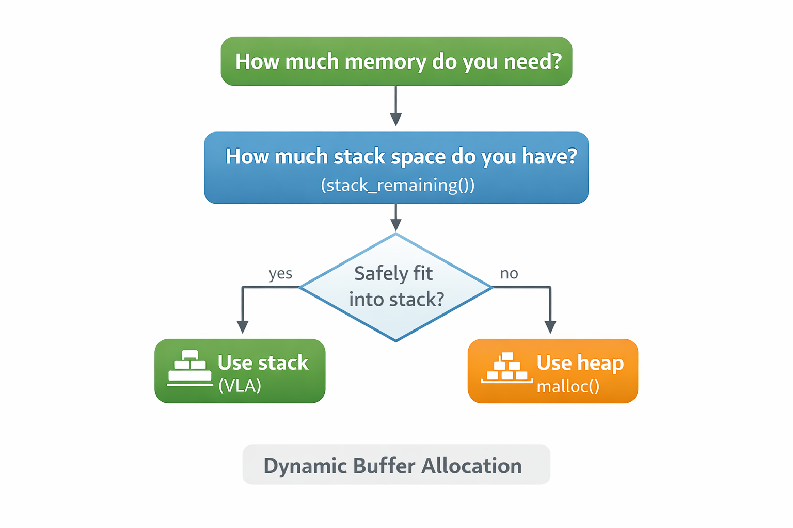

# How Much Stack Space Do You Have? Estimating Remaining Stack in C on Linux

## Practical techniques for estimating remaining stack space at runtime on Linux systems.



In a previous article - [Avoiding malloc for Small Strings in C With Variable Length Arrays (VLAs)](https://medium.com/@yair.lenga/avoiding-malloc-for-small-strings-in-c-with-variable-length-arrays-vlas-7b1fbcae7193) - I suggested using **stack allocation (VLAs)** for
small temporary buffers in C as an alternative to `malloc()`.

One of the most common concerns in the comments was:

> *"Stack allocations are dangerous because you cannot know how much
> stack space is available."*

This concern is understandable. If a program accidentally exceeds the
stack limit, the result is usually a **segmentation fault**.

While the C language and standard library do not expose stack information,  modern operating systems - including Linux -
expose enough information to **estimate available stack space**.

This article explores a few practical techniques to answer the question:

> **How much stack space does my program have left?**

The goal is not perfect precision, but **good enough estimates** to
guide decisions such as whether to allocate memory on the stack or the
heap.

------------------------------------------------------------------------

# The Stack on Modern Linux

On most modern Linux systems the default stack size for a process is typically around *8 MB*. You can confirm this using ulimit, which will report the result in 1024 byte units.

    $ ulimit -s
    8192

On modern Linux platforms (X86-64, ARM, RISC-V, PowerPC) the stack grows **downward in memory**,
meaning that as functions are called and local variables are allocated, the stack
pointer moves toward lower addresses.

    Higher addresses
    ┌───────────────────────────┐
    │  stack start / top        │
    │  main() frame             │
    │  caller frames            │
    │  local variables          │
    │  current stack pointer    │
    │                           │
    │  unused stack space       │
    │                           │
    │  stack limit (guard page) │
    └───────────────────────────┘
    Lower addresses

When the stack grows beyond the guard page, the operating system raises a segmentation fault.

To estimate remaining stack space we need two pieces of information:

1.  **Stack boundaries** (base and size)
2.  **Current stack pointer**

Once we know those, the remaining stack can be approximated by measuring
the distance between them.

    stack_base = lowest stack address
    stack_top  = highest stack address
    stack_remaining = current_stack_pointer - stack_base
    stack_inuse = stack_base + stack_size - current_stack_pointer

------------------------------------------------------------------------

# Getting the Current Stack Pointer

C does not provide an official API to query the stack pointer.

In practice, the address of a **local variable** provides a very good
approximation of the current stack position, since local variables are
typically stored in the current stack frame.

Example:

``` c
static StackAddr stack_marker_addr(void)
{
    char marker;
    return (StackAddr) &marker;
}
```

This address is usually close to the current position of the stack
pointer.

When compiling with higher optimization levels, the compiler may
rearrange stack layout or inline helper functions in ways that make the
measurement less predictable. To reduce this effect, it helps to:

-   take the address of a `volatile` local variable
-   place the logic in a `noinline` helper function

A small helper like the following works well in practice:

``` c
[[gnu::noinline]]
static StackAddr stack_marker_addr(void)
{
    volatile char marker;
    return (StackAddr) &marker ;
}
```
The next step is to get the stack boundaries so that we can estimate the remaining (and inuse) stack space. For the remaining stack space we need the lower address of the stack (stack_base). There are several ways to obtain this address. We will cover:
-   Method 1: Query the Stack Limit with `getrlimit`
-   Method 2: Using `pthread_getattr_np`
-   Method 3: Capturing the Stack Position at Program Startup 


------------------------------------------------------------------------

# Method 1: Query the Stack Limit with `getrlimit`

Linux exposes the maximum stack size through the `getrlimit()` system
call.

``` c
const char *get_stack_base(void)
{
    struct rlimit stack_limit ;
    getrlimit(RLIMIT_STACK, &stack_limit) ;
    stack_size = stack_limit.rlim_cur ;
    // get stack_top from stack_marker_addr
    stack_base = stack_top - stack_limit.rlim_cur ;
    return stack_base ;
}
```

This returns the **maximum stack size** configured for the process.

By capturing the stack pointer **early** in the program and combining it with
maximum stack size, we can estimate the stack base, and the remaining stack
space:

Conceptually:

    stack_top = stack_marker_addr()      // at program start.
    stack_size = ... // from getrlimit
    stack_base = stack_top - stack_size

This method is simple and portable across many Linux systems, but it has few
limitations, in particular: **It requires capturing the stack position early in the program to establish a reference point.**

If the first opportunity to capture the stack address occurs after significant stack allocations have already occurred, we might over-estimate the remaining stack space
as there is no easy way to estimate the space already been used. In those cases, an alternative
method exists.

Complete Implementation (build instruction in comments) as GitHub GIST

Note that RLIMIT_STACK gives the maximum allowed stack, not necessarily the mapped stack. The actual stack memory is usually grown lazily by the kernel as needed.

------------------------------------------------------------------------

# Method 2: Using `pthread_getattr_np`

Linux systems using glibc provide a convenient non-standard extension,
`pthread_getattr_np()`, which allows a thread to query its own stack
attributes, including the stack base address and stack size.

Example Usage:

``` c
    pthread_attr_t attr ;
    void *stack_base ;
    size_t stack_size ;
    pthread_getattr_np(pthread_self(), &attr) ;
    pthread_attr_getstack(&attr, &stack_base, &stack_size) ;
```

From this we can obtain the stack_base, which can now use for estimating the remaining stack, and inuse stack, as discussed above.

This method has several advantages:

-   Works **in multi-threaded programs** (different threads may have different stack size!)
-   Does not require change to program startup
-   Provides **direct access to stack boundaries**

For Linux programs that already use `pthread`, this is often the
**cleanest approach**. Using this technique on single threaded program requires
the program to link with the pthread library, but **does not** launch extra
threads, or introduce thread-safety issues into code that does not otherwise
launch additional threads.

------------------------------------------------------------------------

# Method 3: Capturing the Stack Position at Program Startup

The previous method uses `pthread_getattr_np()` to query stack
boundaries directly. While convenient, it requires linking with the
pthread library and relies on a non-standard GNU extension.

In many programs/libraries, especially single-threaded utilities, it may be
desirable to estimate stack usage **without introducing a dependency on
pthread**.

One simple technique is to capture the stack position **very early in
the program's lifetime**, before additional call frames are created. On
systems using GCC or Clang this can be done using a *constructor
function*.

Functions marked with the `constructor` attribute are executed
automatically before `main()`. The attribute is commonly used by 
runtime libraries (including C++ runtimes) to perform initialization
before main. It can also be used in C programs/functions.

Example:

``` c
static StackAddr stack_base;
static size_t stack_size ;

__attribute__((constructor))
static void capture_stack_region(void)
{
    char *stack_top = stack_marker_addr() ;

    struct rlimit stack_limit ;
    getrlimit(RLIMIT_STACK, &stack_limit) ;

    stack_size = stack_limit.rlim_cur ;
    stack_base = (StackAddr) stack_top - stack_limit.rlim_cur ;
}
```

Because this function runs during program startup, the recorded address
is typically very close to the **top of the initial stack**. Combining this address with the configured stack size provides a good approximation of the
stack base.

Later in the program we can compare this value with the current stack
position to estimate stack usage, and remaining stack

``` c
size_t stack_space = stack_marker_addr() - stack_base ;
```

This approach avoids the need for `pthread`, and the measurement can be
implemented entirely inside a helper module without requiring any
changes to `main()`.

Like the other techniques presented here, this method provides an
**estimate** rather than an exact measurement, but it is often
sufficient to guide decisions such as whether a temporary buffer should
be placed on the stack or the heap.

# Turning This into a Small Utility

Once the stack boundaries are known, it is easy to wrap the calculation
into a small helper functions. The `stack_remaining` helper also tracks the lowest observed stack address to estimate max usage of stack space.

Conceptually:

``` c
static size_t stack_remaining(void)
{
    StackAddr sp = stack_marker_addr() ;
    if ( sp < stack_low_mark ) stack_low_mark = sp ;
    return sp - stack_base - safety_margin;    
}

static size_t stack_inuse(void)
{
    return stack_base + stack_size - stack_marker_addr()
}
```

# A Small Stack Inspection Utility

Note that the `stack_remaining` also tracks the lowest stack marker. This will allow us to expose "stack_info" Similar in spirit to "mallinfo", with the following attributes:

``` c
struct stack_info {
    StackAddr base ;
    size_t size ;
    size_t max_inuse ;
    size_t margin ;
    StackAddr low_mark ;
    ...
}
struct stack_info get_stack_info(void) ;
```

------------------------------------------------------------------------

# Using Stack Estimates to Guide Allocation Decisions

The practical motivation for estimating stack space is simple:

Some allocations are small enough that placing them on the stack is
faster and simpler than using the heap.

However, we want to avoid risking stack overflow.

A simple strategy is to allocate on the stack **only when sufficient
space remains**.

Example logic for a function that needs double[n] temporary storage. 

``` c
function foo(int n, double x)
{
    size_t need_mem = n * sizeof(double) ;
    bool use_vla = need_mem < stack_remaining() ;
    double y_vla[use_vla ? n : 1] ;
    double *y = use_vla ? y_vla : malloc(need_mem) ;
    // Use y as needed
    // Cleanup
    if ( !use_vla ) free(y) ;
}
```

This allows the program to use the stack when it is safe - avoid `malloc` calls
and fall back to the heap otherwise.

------------------------------------------------------------------------

# How Accurate Are These Estimates?

These methods provide **estimates**, not guarantees.

A few factors can influence stack usage:

-   deep call stacks
-   recursion
-   large local variables
-   compiler optimizations
-   thread stack sizes

Because of this, it is wise to leave a **safety margin** when making
decisions based on remaining stack space.

In practice, leaving a few kilobytes (8-32) of buffer is usually sufficient.

------------------------------------------------------------------------

# Conclusion

Although the C language itself does not expose stack information, modern
Linux systems provide enough primitives to estimate stack usage.

Using APIs and features such as:

    getrlimit()
    pthread_getattr_np()
    GCC/CLANG constructor attribute.

a program can determine stack limits and approximate the remaining stack
space at runtime.

This does not eliminate the need for careful programming, but it does
make stack allocation decisions **far more informed than commonly
assumed**.

In a follow-up article we will explore a more experimental approach:
**actively probing the stack itself to discover its limits**.

# Disclaimer
The views expressed in this article are my own and do not necessarily reflect those of my employer.

Some of the code examples in this article were generated with the assistance of AI tools and have not been tested in production environments. They are provided for illustration and experimentation only.

Unless otherwise noted, the code snippets may be used freely for any purpose without warranty of any kind.

If this article was useful, please clap so other C developers can find it.
